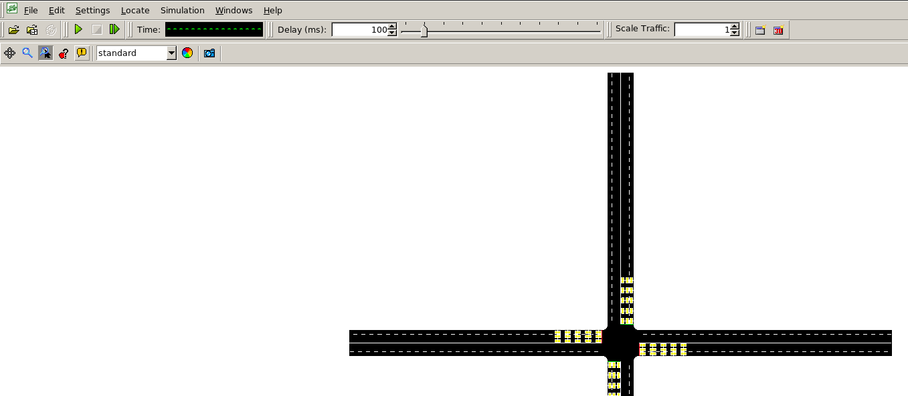

# Traffic Signal Control

This project aims to train an agent to control the flow of traffic through an intersection, using reinforcement learning.

## Authors

- Goh Chian Kai
- Lam Kai Yi
- Ferdinand Tonby-Strandborg

# Setup

## Cloning

This is the process of "downloading" the GitHub repository (remote repository), while retaining the ability to **push** and **pull** changes to/from it.

### SSH Key Generation

Ensure that you have the appropriate SSH keys for using GitHub. Ensure that you remember in which directory the files are created (typically `C:/Users/xxx/.ssh/` for Windows or `~/.ssh/` for Linux).

```sh
ssh-keygen -t ed25519
```

Then copy the contents of the `id_ed25519.pub` file, and go to your GitHub accounts `settings > SSH and GPG keys` (_SSH and GPG keys_ are under the _Access_ grouping in the settings page), and press `New SSH key`. Give it an appropriate _Title_ and paste the contents of the `id_ed25519.pub` file there (leave the _Key type_ as _Authentication Key_). For linux, you can quickly see the contents of this file in terminal using:

```sh
cat ~/.ssh/id_ed25519.pub # Copy the entire output
```

### Git Config

In order to clone a GitHub repository, there are 2 key config items. The first is your **name**. GitHub will accept p. much anything, but use something recognizable (like your full name). The second is you **email**. This must be tied to your GitHub account, otherwise cloning repositories will not work.

```sh
git config --global user.name "Full Name"
git config --global user.email "github.account.email@domain.com
```

### Git Clone

Now you can clone the GitHub repository. The _target_ of this command is standardized for GitHub repositories as `git@github.com:USER/REPOSITORY.git`, where `USER` is the username for the account hosing the repository. For this repository, the `USER` is `Ferdi0412`, and the `REPOSITORY` is `traffic-signal-control`.

```sh
git clone git@github.com:Ferdi0412/traffic-signal-control
```

## Setting up SUMO and Python

After cloning, run the setup.sh script

Shell scripts need permissions to run

```sh
chmod +x setup.sh
```

Run the script

```sh
./setup.sh
```

Activate your conda environment

```sh
conda activate traffic
```

## Running the Code

Ensure that you are in the traffic-signal-control folder

```sh
cd traffic-signal-control/
```

### With GUI

Run the demo code

```sh
python environment/trafficlightgymsumo.py --gui
```

The SUMO gui should appear and you should see a cross intersection in front of you


Change the delay at the top to 100ms and click the play button. The simulation should run.

When it ends, proceed to click yes to closing all open files and views.

You can then view the outputs of the simulation every 10 steps in your terminal.

### Without GUI

If you wish to run the demo code without the gui, type this in the terminal instead.

```sh
python environment/trafficlightgymsumo.py
```

You can now view the outputs of the simulation every 10 steps in your terminal without the GUI popping up.

## File Structure

```txt
traffic-rl-project/
├── requirements.txt
├── environment.yml
├── README.md
├── .gitignore
├── environment/
│   ├── sumo_interface.py
│   ├── traffilightgymsumo.py
│   ├── utils.py
├── sumo_network/
```
